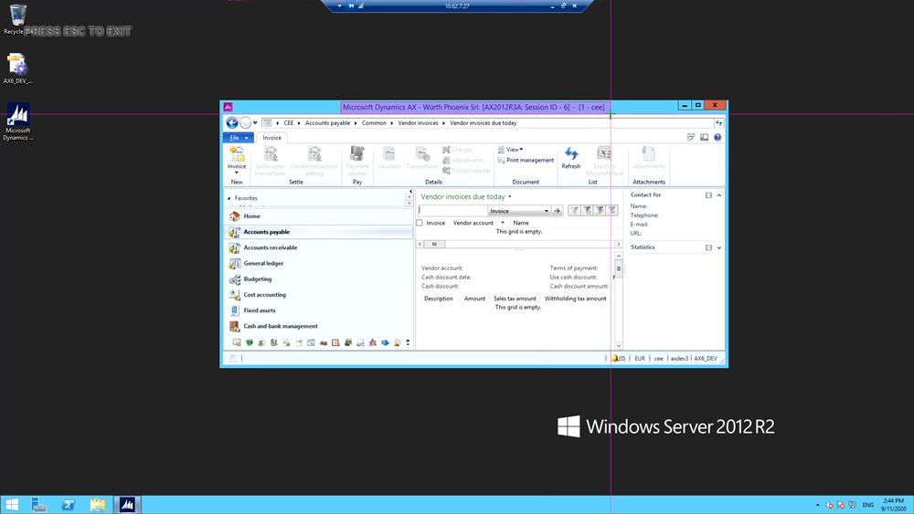
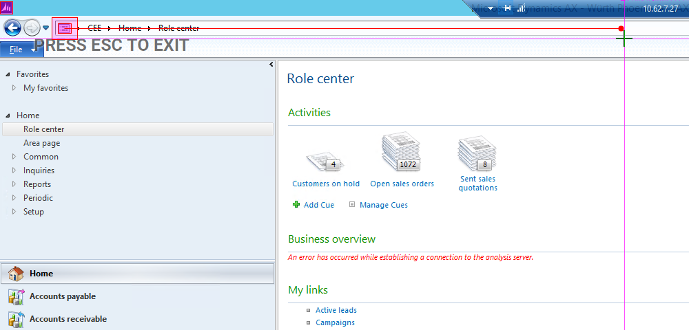
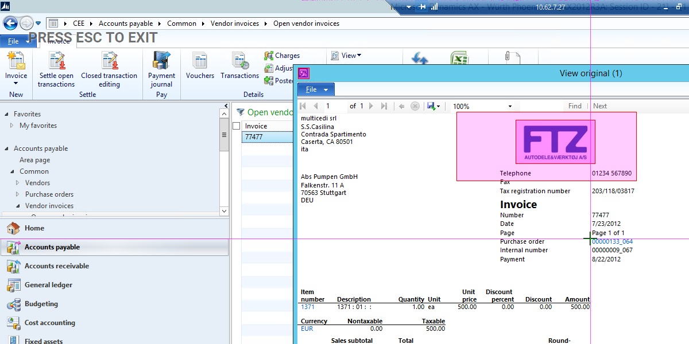
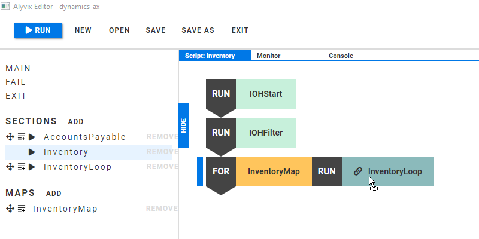
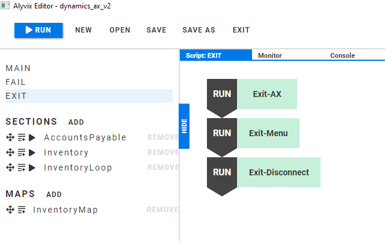
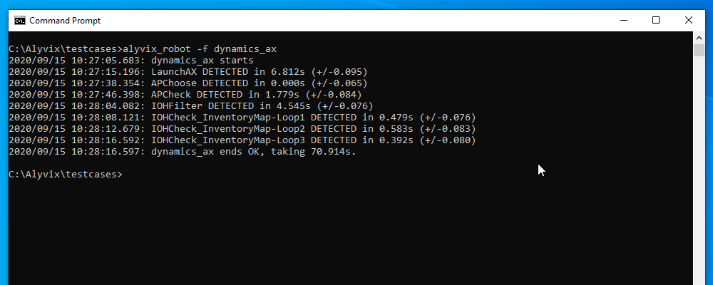

Monitoring installations of Dynamics AX 2012 from a user perspective is important because of the widespread use and importance of AX to business activities. We show how to build a test case to inspect and measure two common tasks within AX: invoice printing within Accounts Payable, and inventory control. An accompanying video in our channel provides further details for those wishing to construct a similar test case themselves.

===

## Monitoring Dynamics AX Visually

Monitoring installations of Dynamics AX 2012 from a user perspective is important because of the widespread use and importance of AX to business activities. In this article we'll look at what it takes to build a complete visual monitoring run for Dynamics AX using Alyvix, looking in particular at the tasks of printing invoices in Accounts Payable and looping over stock items in Inventory Management.

In particular, we will show Alyvix how to navigate to the Open Vendor Invoices database, setting a filter for a specific invoice, opening the invoice it finds, and checking that the Print Preview functionality is working properly. Next, the test case looks at the Inventory Management section, going to on-hand inventory and opening a single item multiple times to ensure continuous availability. Finally, the test case cleans up after itself by closing all the windows it opened and leaving AX in the same state as when Robot started.

Our test case will measure key individual steps to make sure they don't take too long, because if Alyvix sees slow performance, then real users are also seeing slow performance. The end result is the measured transaction times at desired points.

### Launching AX

To start, we need to launch AX, so our first step is to tell Editor where to find the AX desktop shortcut on the screen, and then to launch it by telling Alyvix to double click on the shortcut. Next, we need to make sure that the AX interface is maximized to full screen size before we start using it.

In cases like this which occur frequently when using Alyvix, there are already best practices for how to proceed. To maximize a window, we create two test case objects, one that checks whether the window is already maximized, and another that maximizes the window if it's not. Then we relate the two with Alyvix's
IF FALSE expression.

Our test case will check two different Dynamics AX modules, so let's create a section, or a subroutine, for each. Let's call them "AccountsPayable" and "Inventory" and add them to the main script.

### The Accounts Payable Task

For this monitoring task, suppose we want to filter out a given pre-existing invoice and display it with print preview.

First we'll need to navigate there, so we can write the address for "Open Vendor Invoices" and have Alyvix insert it directly into the address bar. When we create a test case object to implement this, we can follow the typical pattern: create a screen grab, identify important areas on the screen, add any mouse and keyboard input for interactions, tell Alyvix what its name is and how to measure the results, and finally, give it a quick test to make sure it works.

For this navigation subtask, we use two icons to guide us to the address field, show Alyvix where the insertion point should be, and tell Alyvix the text to insert:

 CEE/Accounts payable/Common/Vendor invoices/Open vendor invoices{Enter}

Once done, we give the test case object a name, set the monitoring parameters such as the timeout value, add it to the AccountsPayable section, and then press the "run" button to immediately test it.

Now that we've arrived at the right place, we can select the invoice to display. An important technique when using AX is to filter query results to more easily find what you're looking for. Here we show Alyvix where the filter box is and how to enter an invoice number.

When the results are returned, Alyvix can pick the one in the first row. Here we should check that the line really is the one we want. We can use a text component to scrape the text from a selection onscreen and then match it against a regular expression to be sure. Then we can double click on it to open up the vendor details window.

Once we have the invoice details window, we can start the next step to print out the invoice. To access it, we need to click on the "Original document" menu action, so let's select that action, and then extend the region of interest to the right and left in case its position in the menu changes.

As with the previous test case object, we can use a regular expression to select a subset of text within a larger area of text, and then the click action will click in the center of the matching text rather than the center of the wider region of interest.

Now we're ready to call up the printed invoice. We tell Alyvix to click on the "Print preview" button. Here we unset the Measure checkbox, which means Alyvix won't tell us how long it took for this step to occur, because we want to measure how long it takes to display the invoice, not how long it takes to show the print preview dialog.

For the measurement step, we use the displayed logo of the invoice in the preview window as the main check, enlarging the region of interest so it's more independent of window size. Finding out how long it takes to open the invoice is one of the main indicators of how well our Dynamic AX instance is working, so we set a higher timeout and leave the measure flag set.

We've finished our task, but we still have two windows open. We need to close them before we can go on to the Inventory task, and since we'll need to close windows after that task too, we make a generic test case object for closing any active window. We just need to add that test case object twice to the AccountsPayable section.

### The Inventory On Hand Task

Just as we did at the beginning of AccountsPayable, we create a step that takes us to the On-Hand Inventory interface in Dynamics AX by finding the address icon, setting its click point to the middle of the address bar, and then inserting the Inventory address as a text string.

Our Inventory task will be to find a particular item in On-Hand Inventory and check its details three times by opening and closing its details window. We can pick an item just as we did in AccountsPayable by using a filter.

To open an item's detail window three times, we could just add the test case object three times to the Inventory script. A better way though is to generalize it so you can test as many times as you'd like. We can do this by creating a Map containing three entries, and then iterating over it with a loop.

To do this, add a map with the action at the left of Alyvix Editor, change the name to "InventoryMap", and add three rows. The "key" names on the left will be shown in the output, so it helps to give each key an easily understood name like "Loop1".

We want to loop over more than one action, so the loop object must be a whole section rather than a single test case object. So we'll create another section called "InventoryLoop" within Inventory. The first half will open the product details for the item in the first row of the filtered results. That row is already selected, so we just need to click once on the product details action. 

We want to measure the second part where the item information is displayed, so unset the measure box on the first action. For the second part, whose main purpose is to check when the window with the proper results appears, we can use a regular expression to match the text of the header in the results window.

Now we just need the loop itself. Clicking on the add icon next to "InventoryMap" will create an orange block for the map, and a red block where we can drag "InventoryLoop" to be its argument. When the loop runs, the timing results will appear separately for each iteration.

### The Exit and Fail Scripts

Once the test case finishes, it's important to clean up after ourselves, since we'll likely use Robot to run the test case every few minutes.

The Exit script runs automatically when the main script concludes, whether it finishes successfully or not. In our case we need to closes Dynamics AX and disconnect from the Windows Server.

The Fail script is run before the Exit script if any test case node in either the Main script or a section did not match. Here it closes any opened AX windows before continuing to execute the Exit script.

### Conclusion

In this article we created a full Alyvix test case that monitors Dynamic AX, including printing an invoice in Accounts Payable and looping over requests for details on inventory items. When we run the test case in Alyvix Robot, it displays the timing results for the steps we requested.

