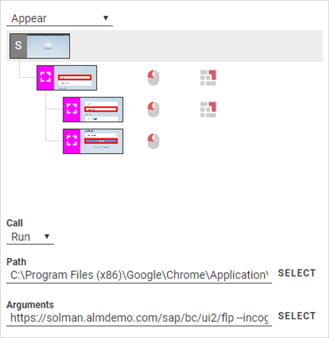
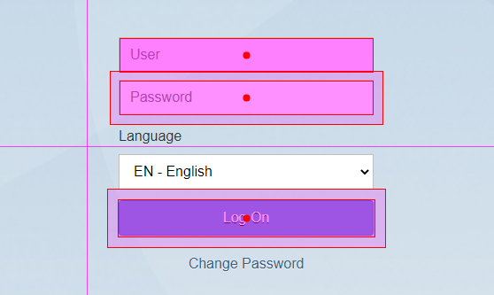
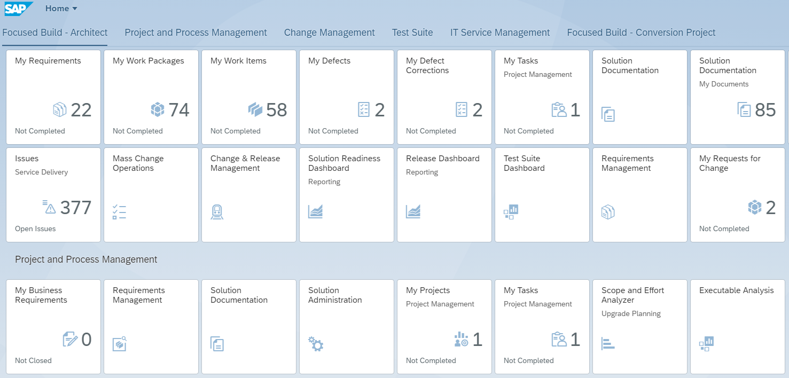
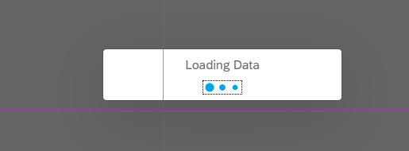
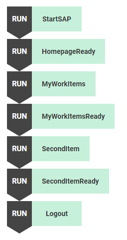
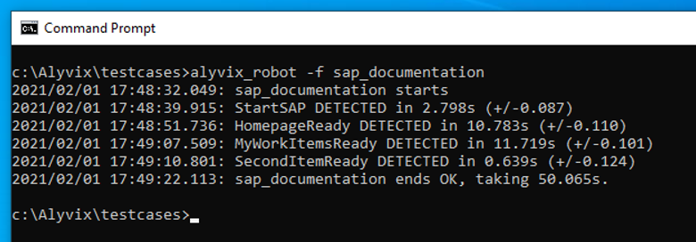

If your company has a lot of resources invested in business processes like those on SAP platforms, then downtime and slowdowns will waste those resources, whether it's money or your employees' time. Alyvix can regularly check that web apps like SAP Solution Manager are always working, so that everything runs smoothly. Let's see how we can build an Alyvix test case that runs through the Work Items task interface in SAP's Solution Manager so we can monitor it visually.


===


## Introduction

Once you've invested three times your typical annual budget to build out business processes throughout your organization, the next thing that will keep you awake at night is making sure that those services are working at all times. Nothing gets your attention like a few hundred DMs and emails at 8:05 AM asking why everybody is locked out and nobody is getting any work done.

We've looked at how to [visually monitor business processes in Microsoft Dynamics AX](https://alyvix.com/blog/20200917_dynamics_ax) before, but there are also other solutions out there. For instance, SAP offers an entire range of ERP and CRM services, one of which is [SAP Solution Manager](https://support.sap.com/en/alm/solution-manager.html). Alyvix won't tell you which one you should choose, in fact it can't even tell which one you're using. But if it's a Windows application, Alyvix can make sure it's available and check its responsiveness, 24 hours a day, 7 days a week.

As with all applications, Alyvix monitors SAP's Solution Manager by interacting with its existing user interface, responding just like a human user would. You don't need to make any changes to SAP software to use it; it already interacts with the same buttons, text fields and controls.

So read on to see how we can use Alyvix to test a single SAP business process.


## Building the Test Case

Solution Manager is a web app, so one of the first things we need to do is launch a browser and point it to the right URL. To run or exit Windows applications, you need to select the root node at the top right (which you can do even if you don't want to create any components by just immediately pressing the ESC key):



You can then choose the application via its executable path, along with any arguments. To open the Chrome browser to a particular page, we can pass it the URL directly, along with the parameters for Incognito/Private mode so that no state is saved between sessions, and full screen mode so that we don't need to create a step to maximize the window for us:

```
Call: Run
Path: C:\Program Files (x86)\Google\Chrome\Application\chrome.exe
Arguments: https://solman.almdemo.com/sap/bc/ui2/flp --incognito --start-maximized
```


### Logging In

The next step is to log in to the application (actually, you can combine this step with the previous one as we did since application calls will always be carried out before any components are matched). Here we need to show Alyvix where it can find each of the interface elements: where to put the user name, the password, and where to click on the logon button. For the two text fields, we also need to tell Alyvix what text to put in each one. (Note that if you're going to use credentials in a production environment, be sure to [encrypt them](http://alyvix.com/learn/videos_and_tutorials/production_systems_tutorials.html#production-tutorials-rdclogin)!)



When Alyvix Robot replays this test case in real time against the live SAP interface, it will insert the values much faster than a person can (which is why we call it Robot). To make sure the steps are run in the right order, like logging in before navigating, we build an ordered script at the top left of the Alyvix screen.

The name of the step is how it's identified in the script. So after we define the interface elements, we then need to give a unique name to our new step. At the same time, we can also add monitoring parameters for this particular step:

* *Timeout:* How long we should try to match the current step before giving up
* *Break:* If we can't match the step's components to the interface within in the timeout, should we completely stop, or try to keep going
* *Measure:* Whether or not Alyvix Robot will report how long it took before a match was made


When we're satisfied with the name and monitoring parameters, we can use the action icons at the left to drag/add this step to the script above, or to immediately test out this step (which is also helpful because it will advance the SAP interface to the next state for us).

### Landing Page

We've now logged in and we see the Solution Manager's landing page that contains tiles for each possible business process, depending on the role of the user that we logged in with. At this point we can choose where we want to go, even using a separate test case for each desired task destination.



For this test case let's create a check for the "My Work Items" action (top row, third from left). To get there, we only need to find the correct tile and click on it. From the point of view of Alyvix, this step is just like the others: we tell Alyvix Editor which interface element(s) we need, and what interactions are necessary.

### My Work Items and Its Check

Once we click on the tile, we don't immediately see anything, because the data first needs to be loaded. Solution Manager puts up a loading animation until the data is available and displayed.



We surely want to measure how long it takes for that data to be visible, so we can look at the time it takes for the loading animation to appear and then disappear. There's a special option available just for these circumstances: the "AppearDisappear" value in the Designer panel at the top right. The hardest part is trying to catch the loading animation while it's onscreen if your system is particularly fast or there's not much data. The solution is to set the appropriate Delay value before clicking the Add button.

When Robot runs this step, it will measure the elapsed time that the loading animation is onscreen, and report it at the end of its run (as long as you left the Measure flag set!)

### The Second Work Item and Its Check

Finally we've arrived at the last page we want to check. To be sure that everything has loaded properly, we look for a number of icons and labels and make sure they are in the right places. If they can't be found, then something went wrong. In the case of a web app like SAP Solution Manager, it means the web page either didn't load, or didn't load properly, indicating a problem that would keep an employee from completing their task.

As we navigate, we're not limited to interacting just with the elements we select. As an example, we can match the icon at the top left of the page, but choose to click on the second box in the list below it, which will cause the details of that second item to be displayed.

When we do that, Solution Manager will put up a loading animation just as it did in the last step. But loading animations are identical across the whole Solution Planner application, so instead of redoing the previous step, we can use the "Duplicate" action at the bottom of Selector to copy that entire action in one click; the only change we need to make is to give it a new name.

And with that, we've finished the main part of our check, all that's left is to clean up.

### Logging out and Killing the Browser

Of course, if we're going to run Alyvix Robot repeatedly using the same test case, then the state of the application at the end much match the application state when it started.

With a web app like this SAP Solution Manager, we need to log out so that the next time we can log in again with a clean state. Since our main check is over, we don't really need to log out the same way a user does. In fact, logging out that way requires three separate interactions, and thus we would need three separate steps in Alyvix. As an alternative, we can log out in just one step by directly inserting the URL that SAP itself uses.

We also need to kill the browser, since at the beginning we launched it maximized and in private mode. To do this, we select our root node just as when we started Chrome in the first step above, select the Kill command, and then choose the browser from the dropdown list.

### Fail and Exit Scripts

We could put both of these steps in the Main script and leave it at that. But best practice tells us to put the Logout step in both the Main and Fail scripts, and to kill the browser in the Exit script. But why?

To understand this you need to realize that it's possible that the test case may fail. In fact, the whole reason for using Alyvix at all is that eventually your business processes will fail. If Alyvix Robot is halfway through the test case when this happens and a *break* flag is set for some intermediate step, then Alyvix won't execute any steps after that, including the logout and kill steps.

That's why we have these two scripts:

* *Fail:* When a step cannot be matched within the timeout period, and that step's *break* flag is set, control is transferred from the Main script to the Fail script.
* *Exit:* This script is *always* executed at the end of a test case, after both the Main and Fail scripts, *regardless* of whether there was a failure or not.

So by putting the Logout step in the Fail script, we ensure that it will always be executed. And by killing the browser in the Exit script, we ensure it will always be the very last step, and thus that we've logged out before killing it.

And with that, our test case is now ready to be run by Alyvix Robot as frequently as you need.




## Full run with Alyvix Robot

The runtime component is called Alyvix Robot. Once you've built a test case, you can run that test case from the command line, and Alyvix will then step through the interface actions you configured in Alyvix Editor.



You can then schedule Robot to run the test case multiple times, collecting the results that show your application's latency and uptime. The test case runs as fast as your hardware and software allow, much faster than a human.

As Robot runs, it collects timing data for every step whose Measure box was checked, and when the test case has completed, it shows both the time it took and the precision for each of those steps to match what was shown on the screen. These results can be sent directly to a monitoring system for further analysis and visualization.


### Conclusion

So there you have it, a complete Alyvix test case that runs a full check on one particular task within SAP's Solution Manager. By integrating Alyvix Robot with a monitoring system, you can discover when your business services are slow or fail, often even before your users do. Using a separate test case for each commonly used task, you'll be able to check that all of your important business services are constantly up and running.

<iframe width="288" height="162" src="https://www.youtube.com/embed/qU7Lwwn8Bvc?color=white&rel=0" frameborder="0" allow="accelerometer; autoplay; encrypted-media; gyroscope; picture-in-picture" allowfullscreen></iframe>
