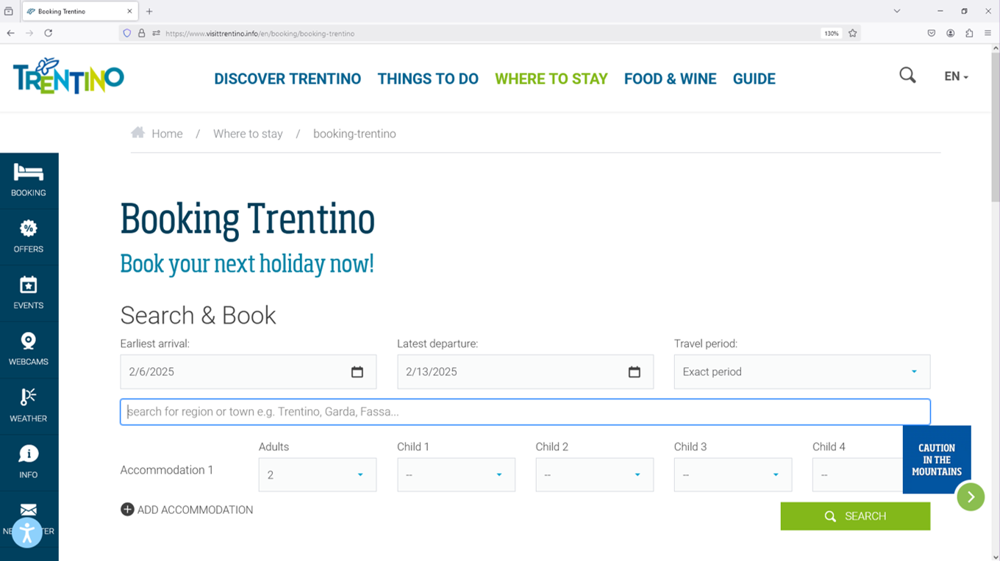
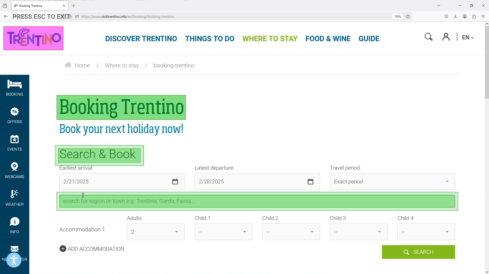
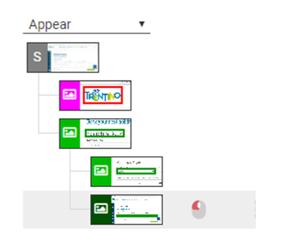
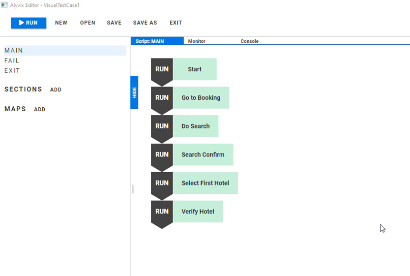
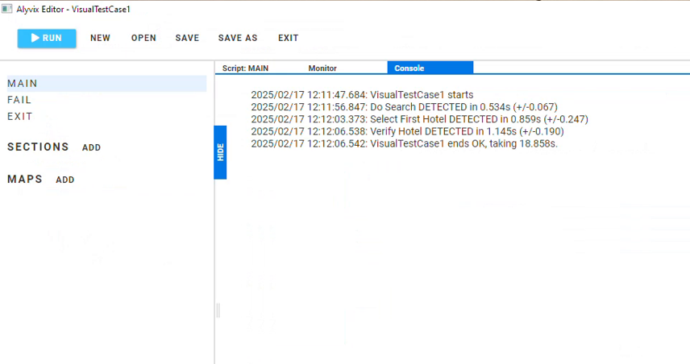

<!--BLOG ABSTRACT-->

Learn the basics of Alyvix Core and Alyvix Editor in just two minutes.  Build and run checks for your critical application tasks, from the user's point of view.

===

<!--BLOG ARTICLE-->

## Not Just Automation

Whether you prefer reading or [watching](https://youtu.be/42aKU7L5QYc), you can learn the basics of Alyvix in just 2 minutes.

Alyvix lets you automate any Windows application, but importantly it also measures how long each automated step takes as it runs.

You can use Alyvix to do things like update CRM contact data, log in through a web portal, even book a hotel room online.

Let's say for instance you run a website for booking hotels, and you know if your site is slow or broken, you'll lose customers. How can you know, at any given moment, if your customers can actually use your site or not?  If they press the search button does it search? Does it show pictures of the room? Can they navigate to the payment page?

Alyvix can tell you the answers to those questions, whenever you need to know, because it can mimic a user walking through every step in the booking process using the same browser interface that your users do. 

When Alyvix runs through each step in an automated Alyvix script, there are three parts:

* *Verify* the application's GUI is showing what it's supposed to be showing
* *Perform* an action like clicking on a button or type in a city name in the app's interface
* *Measure* the time taken until the GUI correctly shows the next correct step

## Building a Task Step

So how do we put together these three parts of one of our application task steps in Alyvix? We use Alyvix Editor, part of the free, open source Alyvix Core.

Suppose during a reservation one of our steps requires us to type a destination city into a form. How does this fit into our first two points above?

* *Verify:* Look at the application's window, and make sure some specific images, icons or text is there and in the place we expect it to be.  To do this, we use Alyvix Editor to make a screen grab of the window, and use the mouse to mark which of these graphical elements should be there, and where.
* *Perform:* Given those marked elements, some of them might need a mouse click (e.g. a button), some text to type in (e.g. a text field), or even scrolling, hovering or pressing the PageUp/PageDown key.

To get Alyvix to see the webpage, we make a copy of the screen (a screen grab) with the "Add" button shown at the bottom of the Alyvix Editor screen.

Then we use that copy to show Alyvix which parts of the interface are important, such as images, buttons, or text fields. 

For the Verify part, we first make sure we're on the correct webpage by looking for one or more images or graphics that are unique and are always in the same place, like the logo at the top left.  Then we draw a box around it, as well as any other graphic elements on the same screen that are important:

But how does Alyvix know what text to type when it runs? In Alyvix Editor, these boxes are at the top right. (Press the Escape key to go from the screen grab back to Alyvix Editor.)

We want Alyvix to make sure that exact image is visible on the page, which is the default behavior. If the website isn't working, Alyvix will see "Page not found" instead of the logo, and it will stop right there.

For the fourth box, we add a mouse click and the text we want in this field at the bottom right, and when our script runs, Alyvix will enter that text into the interface. 

## Making and Running a Script from Multiple Task Steps

We've built up the elements of our task step, so now we're ready to name it and add it to our script.  Building up an entire task is just repeating the process above for every step we need in that task, and then ordering them by name:

Our script is now ready to run, so we press the big blue "Run" button at the top left of Alyvix Editor.  We can watch it run, and when it's done Alyvix will show us the timing results:

This corresponds to the third bullet point above.  Alyvix tells us the total time at the bottom, as well as the intermediate times of the important steps, counting how long it takes to proceed from the "Action" of one step, to the "Verification" of the next step.  Alyvix measures with millisecond precision, and accuracy that's dependent on the speed of your hardware. 

You can even run your new script as many times you like in Alyvix Robot, and Alyvix will go through the task from start to finish, just as if a person were doing the clicking and typing.

Alyvix also works perfectly for synthetic monitoring if you integrate it with a monitoring system. In that case Alyvix will send the measurements there for analysis, action and dashboarding for Sys Admins.

## Done in Two Minutes!!

And that's Alyvix in 2 minutes. Get started now with the free, open source Alyvix Core.

<iframe width="288" height="162" src="https://www.youtube.com/embed/42aKU7L5QYc?color=white&rel=0" frameborder="0" allow="accelerometer; autoplay; encrypted-media; gyroscope; picture-in-picture" allowfullscreen></iframe>
